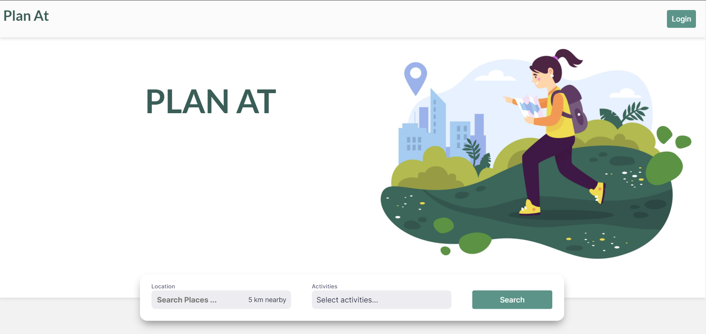
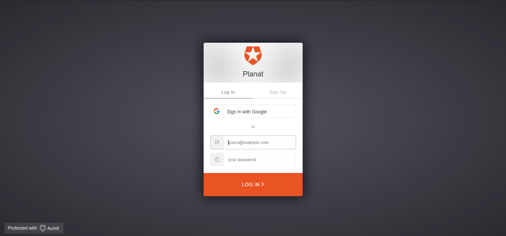
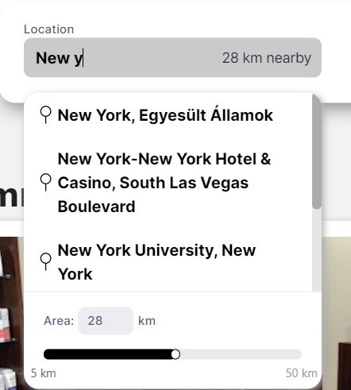
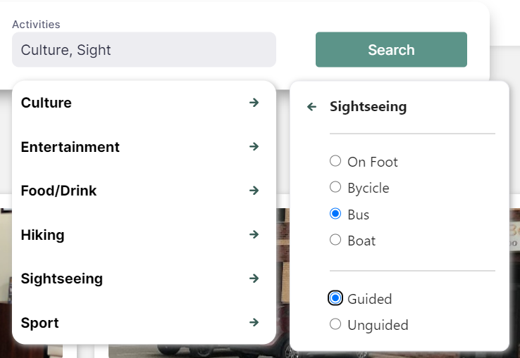
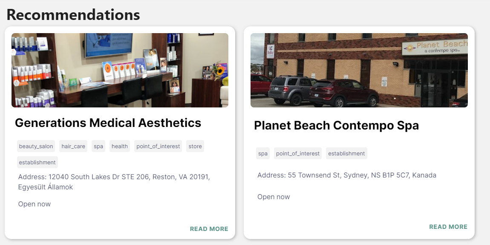
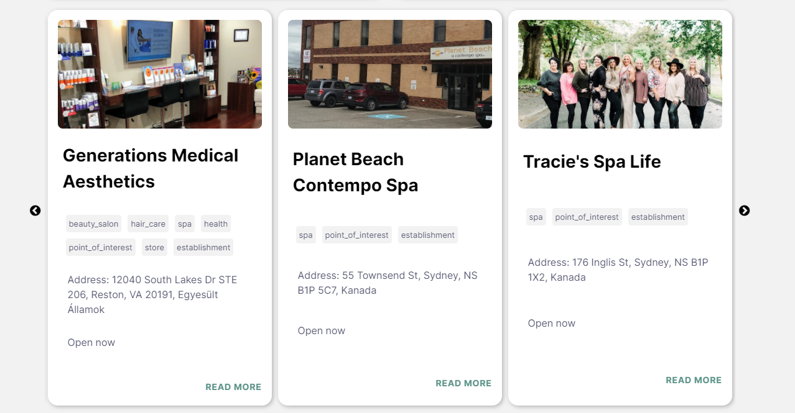
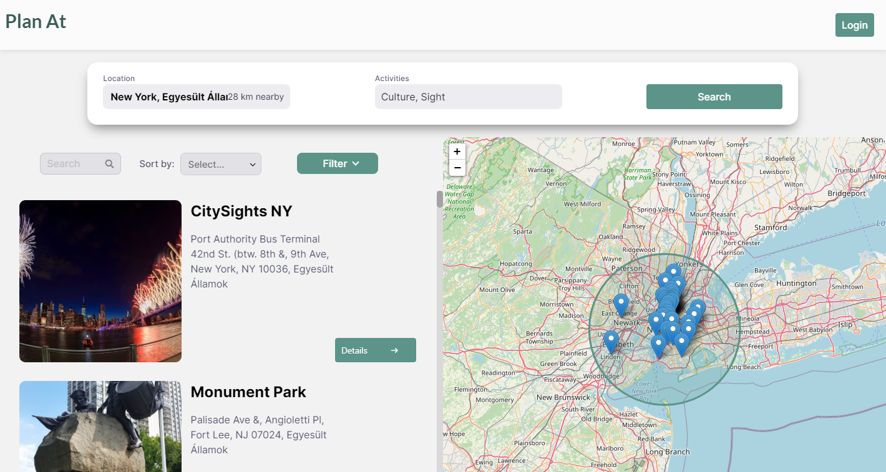
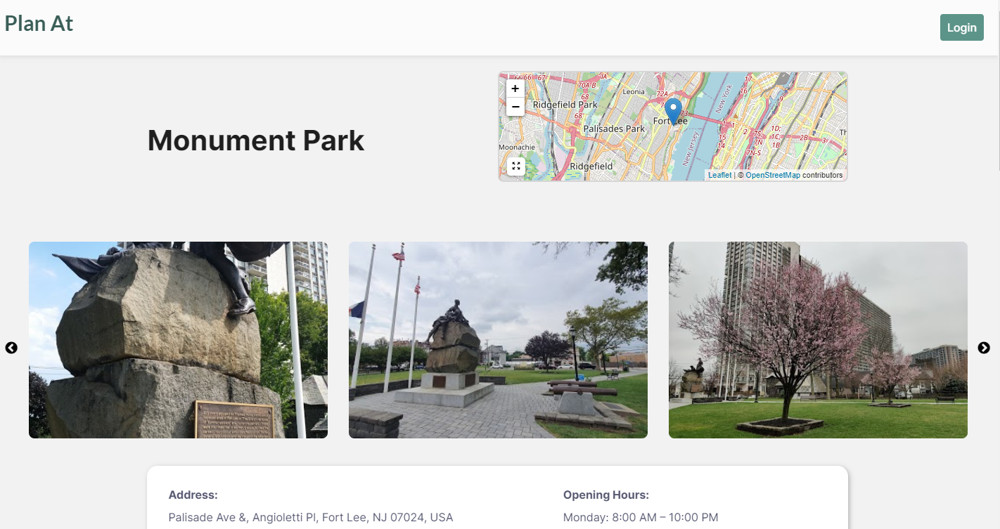
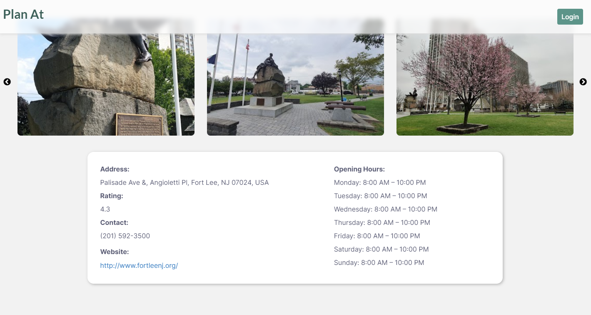
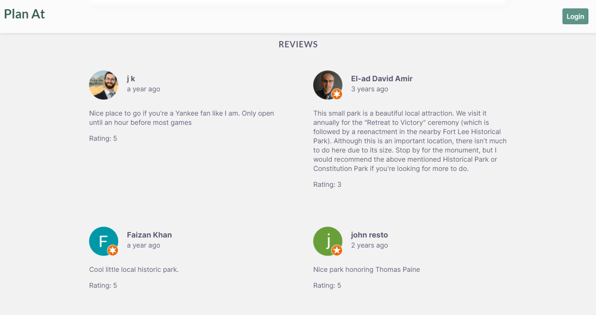

# Planat - Summer internship project 2020

Planat is a single page web application (SPA) written in reactJS. The user can search for any kind of place all over the world, according to his/her interest.
Google Places API is used to retrieve the information about the places.

## It's useful for the users who:

* want to explore new places
* want to visit places which can have interest in
* don't have concrete destination
* want to try out new things

## About the project

### Used technologies

* reactJS, HTML5, CSS
* Google Places API - for retrieving data about the places
* Firebase - to store user's email and password, search history
* Auth0 - for authentication
* Leaflet - for displaying places on the map

### Some important node packages

* firebase
* leaflet
* leaflet-geocoder
* react-places-autocomplete
* rc-slider
* react-slick-carousel

## The website contains three 'pages':

### 1.Homepage

The homepage contains:

* navigation bar
* logo image
* search bar
* recommendation component
* slider with more recommendations

The navigation bar is there on every pages and contains a "Plan at" text at the left, after clicking on it the user is redirected to the homepage. At the right there is a button for logging in, after clicking on it the user can log in with Auth0.

At the searchbar the user can pick a place anywhere in the world (the places are retrieved from the Google Places API) with an autocomplete search, and then can pick a distance for searching in an area. Then the user can choose his/her interest, as many as he/she wants. 

   
  

Then the user can see two types of recommendation.

 

### 2.Page with the search results

Here the user can search again and see the search results with the places, and a map with the results's place on it.

### 3.Detail page

After clicking on a search result, the user can see the details of a place: name, place on the map, pictures etc.
The user can also see the reviews by other people and a recommendation slider, with recommendations around the searched place.

 

 

